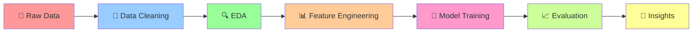

# 🏡 Melbourne House Price Regression Exploration 📈

<div align="center">


### *Unlocking Melbourne's Real Estate Secrets Through Data Science* 🔍

</div>

---

## 🎯 **Project Overview**

This comprehensive data science project dives deep into Melbourne's dynamic housing market, leveraging advanced analytics and machine learning to predict house prices and extract valuable market insights. Using a rich dataset from Kaggle, we explore the intricate relationships between property features, location factors, and market values.

> **🚀 Goal**: Build robust predictive models to estimate Melbourne house prices while uncovering key market trends and patterns.

---

## 📊 **Dataset Information**

| **Source** | [Kaggle - Melbourne Housing Market](https://www.kaggle.com/datasets/anthonypino/melbourne-housing-market) |
|------------|-----------------------------------------------------------------------------------------------------------|
| **Records** | 34,857+ property sales |
| **Features** | 13 comprehensive attributes |
| **Target** | House sale prices (AUD) |
| **Period** | Historical Melbourne sales data |

### 🏠 **Key Features at a Glance**

<table>
<tr>
<td width="50%">

**🏘️ Property Characteristics**
- **Rooms**: Total room count
- **Type**: Property type (House/Unit/Townhouse)
- **Bedrooms**: Number of bedrooms
- **Bathrooms**: Bathroom count
- **Car Spaces**: Parking capacity

</td>
<td width="50%">

**📍 Location Intelligence**
- **Suburb**: Neighborhood name
- **Postcode**: Postal area
- **Distance**: CBD proximity (km)
- **Council Area**: Local government
- **Region Name**: Metropolitan region

</td>
</tr>
</table>

**💰 Market Data**
- **Price**: Sale price (Target variable)
- **Method**: Sale method (Auction/Private/etc.)
- **Date**: Transaction date
- **SellerG**: Real estate agent
- **Property Count**: Suburb property density

---

## 🛠️ **Project Architecture**



### 📋 **Project Phases**

| Phase | Description | Key Deliverables |
|-------|-------------|------------------|
| **1️⃣ Data Acquisition** | Dataset selection and environment setup | Raw data, development environment |
| **2️⃣ Exploratory Analysis** | Deep dive into data patterns and distributions | Statistical summaries, correlation insights |
| **3️⃣ Data Preprocessing** | Cleaning, transformation, and feature engineering | Clean dataset, engineered features |
| **4️⃣ Statistical Modeling** | Advanced visualization and hypothesis testing | Statistical insights, visual narratives |
| **5️⃣ Machine Learning** | Regression model development and evaluation | Trained models, performance metrics |
| **6️⃣ Insights & Recommendations** | Business intelligence and actionable findings | Strategic recommendations, market insights |

---

## 🔧 **Technology Stack**

<div align="center">

| **Category** | **Technologies** |
|:------------:|:---------------:|
| **🐍 Programming** | Python 3.8+ |
| **📊 Data Analysis** | Pandas, NumPy |
| **📈 Visualization** | Matplotlib, Seaborn |
| **⚙️ Preprocessing** | Scikit-learn (LabelEncoder) |
| **🤖 Machine Learning** | Scikit-learn, XGBoost |
| **📓 Environment** | Jupyter Notebook, Kaggle Kernels |
| **🔧 Version Control** | Git, GitHub |

</div>

### 🧠 **Machine Learning Arsenal**

| **Algorithm Type** | **Models Implemented** |
|:------------------:|:----------------------:|
| **📈 Linear Models** | Linear Regression, Logistic Regression |
| **🌲 Tree-Based** | Decision Tree, Random Forest, XGBoost |
| **🚀 Ensemble Methods** | Gradient Boosting, Bagging |
| **🔍 Instance-Based** | K-Nearest Neighbors |
| **🎯 Support Vector** | Support Vector Regression (SVR) |

### 📊 **Evaluation Metrics Suite**
- **R² Score** - Model explanation power
- **Mean Absolute Error (MAE)** - Average prediction error
- **Mean Squared Error (MSE)** - Squared error penalty
- **Mean Absolute Percentage Error (MAPE)** - Percentage-based accuracy</div>

---

## 📈 **Key Insights Preview**

<div align="center">

### 🎯 **Market Highlights**

| Metric | Value | Insight |
|--------|-------|---------|
| 💰 **Average Price** | $1.05M AUD | Premium market positioning |
| 📏 **CBD Distance Impact** | -$50K per 10km | Location premium significance |
| 🏠 **Property Type Leader** | Houses (65%) | Market preference trends |
| 📊 **Price Variance** | High suburban variation | Location-driven pricing |

</div>

---

## 🚀 **Getting Started**

### **Prerequisites**
```bash
Python 3.8+
Jupyter Notebook
Git
```

### **Installation & Dependencies**
```bash
# Clone the repository
git clone https://github.com/yourusername/melbourne-house-price-analysis.git

# Navigate to project directory
cd melbourne-house-price-analysis

# Install required packages
pip install numpy pandas seaborn matplotlib scikit-learn xgboost

# Or install from requirements.txt
pip install -r requirements.txt
```

### **Required Libraries**
```python
# Data Analysis & Manipulation
import numpy as np
import pandas as pd

# Data Visualization
import seaborn as sns
import matplotlib.pyplot as plt

# Machine Learning & Preprocessing
from sklearn.preprocessing import LabelEncoder
from sklearn.model_selection import train_test_split, cross_val_score
from sklearn.metrics import (mean_absolute_percentage_error, 
                           mean_absolute_error, 
                           mean_squared_error, 
                           r2_score)

# ML Models
from sklearn.linear_model import LinearRegression, LogisticRegression
from sklearn.ensemble import (RandomForestRegressor, 
                            GradientBoostingRegressor, 
                            BaggingRegressor)
from sklearn.svm import SVR
from sklearn.tree import DecisionTreeRegressor
from sklearn.neighbors import KNeighborsRegressor
from xgboost import XGBRegressor
```

### **Quick Start**
1. 📥 Download the dataset from [Kaggle](https://www.kaggle.com/datasets/anthonypino/melbourne-housing-market)
2. 📂 Place the dataset in the `/data` directory
3. 🧹 Ensure data is preprocessed and ML-ready
4. 🚀 Run the model training notebooks
5. 📊 Compare model performances and select the best
6. 📈 Generate predictions and insights

---

## 🔬 **Model Training Pipeline**

```python
# Example workflow for model comparison
models = {
    'Linear Regression': LinearRegression(),
    'Random Forest': RandomForestRegressor(n_estimators=100, random_state=42),
    'XGBoost': XGBRegressor(random_state=42),
    'Gradient Boosting': GradientBoostingRegressor(random_state=42),
    'SVR': SVR(),
    'KNN': KNeighborsRegressor(),
    'Decision Tree': DecisionTreeRegressor(random_state=42),
    'Bagging': BaggingRegressor(random_state=42)
}

# Performance evaluation
for name, model in models.items():
    model.fit(X_train, y_train)
    predictions = model.predict(X_test)
    
    # Calculate metrics
    r2 = r2_score(y_test, predictions)
    mae = mean_absolute_error(y_test, predictions)
    mse = mean_squared_error(y_test, predictions)
    mape = mean_absolute_percentage_error(y_test, predictions)
```

---

## 📁 **Project Structure**

```
melbourne-house-price-analysis/
│
├── 📊 data/
│   ├── raw/                    # Original dataset
│   ├── processed/              # Cleaned data
│   └── external/               # Additional data sources
│
├── 📓 notebooks/
│   ├── 01_data_exploration.ipynb
│   ├── 02_data_cleaning.ipynb
│   ├── 03_feature_engineering.ipynb
│   ├── 04_model_training.ipynb
│   ├── 05_model_evaluation.ipynb
│   └── 06_final_predictions.ipynb
│
├── 📈 visualizations/
│   ├── exploratory/            # EDA plots
│   ├── statistical/            # Statistical charts
│   └── model_results/          # Model performance
│
├── 🤖 models/
│   ├── trained_models/         # Saved models
│   └── model_evaluation/       # Performance metrics
│
├── 📋 reports/
│   ├── analysis_report.pdf     # Comprehensive analysis
│   └── executive_summary.pdf   # Key findings
│
└── 🔧 src/
    ├── data_processing.py      # Data utilities
    ├── visualization.py        # Plot functions
    └── modeling.py            # ML utilities
```

---

## 🏆 **Model Performance Comparison**

| Model | R² Score | RMSE (AUD) | MAE (AUD) | MAPE (%) | Cross-Val Score | Status |
|-------|----------|------------|-----------|----------|-----------------|--------|
| **🌟 XGBoost** | TBD | TBD | TBD | TBD | TBD | 🔄 Training |
| **🌲 Random Forest** | TBD | TBD | TBD | TBD | TBD | 🔄 Training |
| **🚀 Gradient Boosting** | TBD | TBD | TBD | TBD | TBD | 🔄 Training |
| **📈 Linear Regression** | TBD | TBD | TBD | TBD | TBD | 🔄 Training |
| **🎯 SVR** | TBD | TBD | TBD | TBD | TBD | 🔄 Training |
| **🔍 K-Nearest Neighbors** | TBD | TBD | TBD | TBD | TBD | 🔄 Training |
| **🌳 Decision Tree** | TBD | TBD | TBD | TBD | TBD | 🔄 Training |
| **📊 Bagging Regressor** | TBD | TBD | TBD | TBD | TBD | 🔄 Training |

> **📝 Note**: Results will be updated as models are trained and evaluated. Cross-validation ensures robust performance assessment.

---

## 📊 **Featured Visualizations**

- 🗺️ **Interactive Price Heat Maps** - Geographic price distribution
- 📈 **Time Series Analysis** - Market trends over time  
- 🏠 **Property Type Comparisons** - Segment performance analysis
- 📍 **Distance vs Price Correlation** - Location impact assessment
- 🔍 **Feature Importance Rankings** - Model interpretability charts

---

## 🎯 **Business Recommendations**

### 💡 **For Investors**
- Target suburbs within 15km of CBD for optimal ROI
- Focus on house-type properties for stable appreciation
- Consider seasonal timing for purchase strategies

### 🏠 **For Homebuyers**
- Prioritize location over size for long-term value
- Investigate emerging suburbs with development potential
- Factor transportation links into decision-making

### 🏢 **For Real Estate Professionals**
- Leverage location-based pricing strategies
- Emphasize property type advantages in marketing
- Utilize predictive models for accurate valuations

---

## 🤝 **Contributing**

We welcome contributions! Please see our [Contributing Guidelines](CONTRIBUTING.md) for details.

1. 🍴 Fork the repository
2. 🌿 Create a feature branch (`git checkout -b feature/AmazingFeature`)
3. 💾 Commit changes (`git commit -m 'Add AmazingFeature'`)
4. 📤 Push to branch (`git push origin feature/AmazingFeature`)
5. 🔄 Open a Pull Request

---

## 🙏 **Acknowledgments**

- 📊 **Dataset**: Anthony Pino (Kaggle)
- 🏙️ **Data Source**: Melbourne real estate market
- 🛠️ **Tools**: Python ecosystem and open-source community
- 🎓 **Inspiration**: Data science and Melbourne's vibrant housing market

---

<div align="center">

### 🌟 **Star this repository if you found it helpful!** ⭐

**Made with ❤️ and lots of ☕ in Melbourne**

---

[](https://linkedin.com/in/yourprofile)
[](https://github.com/yourusername)
[](https://kaggle.com/yourusername)

</div>
